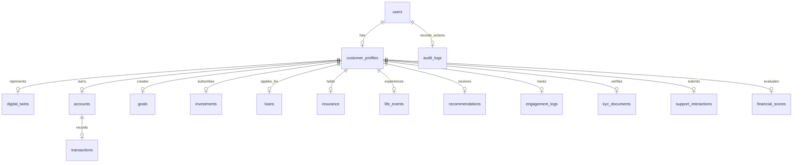

# 🧬 Technical Architecture: SBI SmartLife AI Agent

This document outlines the detailed system architecture, data models, and agent execution patterns powering the SBI SmartLife AI Agent platform.

---

## 🏛️ Overall System Topology

The platform is designed as a modular, containerized three-tier architecture:

1. **Frontend Presentation Layer**: Built on Next.js 16 (App Router) using React, Tailwind CSS, and Recharts, utilizing an elegant dark-mode glassmorphism theme customized with SBI's official color palette.
2. **Backend API Gateway & Agent Layer**: A FastAPI server running asynchronous endpoint handlers. It hosts the LangGraph AI multi-agent orchestration engine.
3. **Storage & Vector Layer**:
   - **PostgreSQL**: Serving as the relational database for customer profiles, accounts, transactions, audit logs, and compliance consents.
   - **ChromaDB**: An embedded vector store housing embeddings of customer transaction histories, behavior summaries, and interaction logs, enabling semantic queries and similarity-based product mapping.

---

## 🤖 Multi-Agent Orchestration (LangGraph)

The platform implements a **Supervisor-Specialist** design pattern using LangGraph.

### Message Flow Lifecycle

```
[User Message / Event]
         │
         ▼
┌─────────────────────────┐
│  Orchestrator Node      │
│  (Intent Classifier)    │
└────────┬────────────────┘
         │
         ├───────────────► [Direct Reply? e.g. Greeting] ──► [Return to User]
         │
         ▼ (Routes context to selected Specialist)
┌────────────────────────────────────────────────────────┐
│  Specialist Agent Node                                 │
│  (e.g., Wellness Agent, Life Events Agent)             │
└────────┬───────────────────────────────────────────────┘
         │
         ▼
┌─────────────────────────┐
│  Compliance Middleware  │ (Ensures response obeys DPDP consent
│  (RBI Rules Filter)     │  and banking guidelines)
└────────┬────────────────┘
         │
         ▼
┌─────────────────────────┐
│  Digital Twin Sync      │ (Updates twin traits/scores if the
│  (Database Update)      │  interaction changed user behavior)
└────────┬────────────────┘
         │
         ▼
    [Final Response]
```

### The 6 Specialist Agents

1. **Acquisition Agent (`acquisition.py`)**: Responsible for lead conversion, describing bank products (savings, credit cards, mutual funds), and guiding through onboarding.
2. **Adoption Agent (`adoption.py`)**: Focused on increasing digital service engagement. Identifies users who are not active on YONO or UPI and provides interactive walkthrough steps.
3. **Engagement Agent (`engagement.py`)**: Analyzes transaction frequency and account balances to suggest hyper-targeted promotions, cashbacks, and interest rate deals.
4. **Wellness Agent (`wellness.py`)**: Performs budget audits, calculates the wellness score, detects overspending, and suggests custom savings milestones.
5. **Life Events Agent (`life_events.py`)**: Processes transactional feeds to detect major changes (such as salary hike, marriage, relocation, or child birth) and flags them in the database.
6. **Relationship Manager (`relationship.py`)**: Handles fallback support, logs user issues, updates service tickets, and manages general account queries.

---

## 💾 Database Entity Relationship (ER) Summary

The relational database consists of 18 tables managing state across the platform:



### Key Data Tables

- **`digital_twins`**: Stores the behavior vectors, spending profile JSON (percentages per category), risk tolerance, and the financial health score.
- **`financial_scores`**: Historical log of wellness, credit, engagement, and risk scores computed weekly.
- **`life_events`**: Chronological log of detected real-world events, containing confidence scores and whether a banking action was successfully triggered.
- **`recommendations`**: AI-generated products matching a specific customer with an explicit reasoning string generated by the matching agent.
- **`agent_actions`**: Performance monitoring table logging latency, agent type, tokens consumed, and actual action results.

---

## 🧬 Customer Digital Twin Engine

The Customer Digital Twin is a numerical and semantic model of a customer. It consists of:
1. **Behavioral Embedding Vector**: A 1536-dimensional vector generated from the customer's transaction categories, transaction frequency, and interaction history. This vector is queried in ChromaDB to find similar cohorts.
2. **Deterministic Rules Model**: A scoring function that calculates:
   - **Wellness Score**: Based on debt-to-income ratio, savings rate, and goal progress.
   - **Engagement Score**: Based on YONO logins, UPI transfers, and support tickets.
   - **Churn Risk**: Elevated by decreasing transaction volumes or account balances.
3. **Predictive Analytics**: Machine Learning models (or fallback heuristic estimators) that forecast:
   - **Propensity to Buy**: Likelihood of accepting a home loan, credit card upgrade, or SIP mutual fund.
   - **Next Best Action (NBA)**: The optimal next communication step to take.
